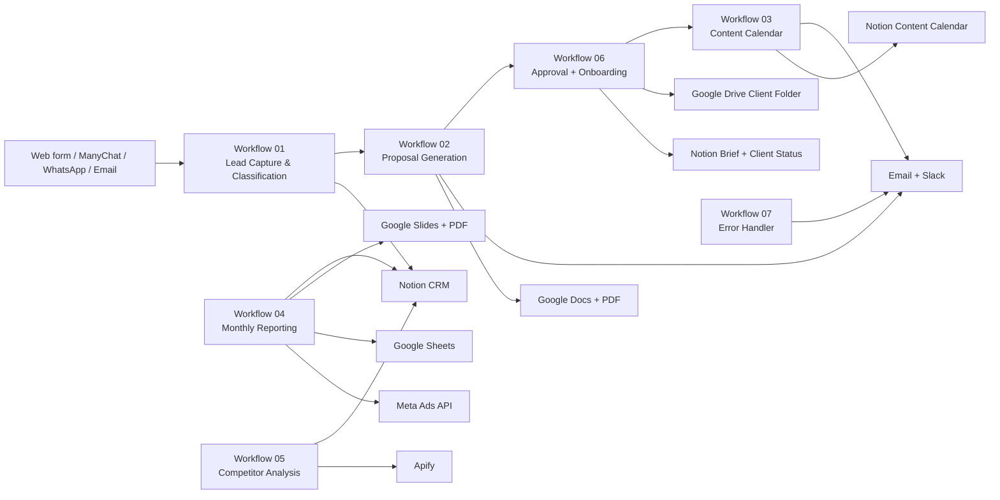

# Yankura Automation Architecture

## Katmanlar

- Girdi: HTML form, ManyChat webhook, WhatsApp webhook ve IMAP tetikleyicileri `Workflow 01` içine akar.
- Orkestrasyon: n8n `queue mode` ile `postgres + redis` üzerinde çalışır; `n8n-main` UI/webhook, `n8n-worker` ise execution yükünü taşır.
- AI: Claude veya OpenAI seçimi env üzerinden yapılır. Tüm workflow’lar ortak prompt sözleşmesi kullanır ve JSON cevap bekler.
- Entegrasyonlar: Notion, Google Drive/Docs/Slides/Sheets, Resend, Slack, Meta Graph ve Apify çağrıları code node içindeki HTTP yardımcılarıyla yürür.
- Çıktı: teklifler, onboarding mailleri, aylık rapor PDF’leri ve operasyon bildirimleri otomatik çıkar.

## Beklenen Notion Şemaları

- Lead database: `Name`, `Email`, `Phone`, `Company`, `Sector`, `Source`, `Category`, `Lead Status`, `Lead ID`, `Requested Service`, `Request`, `Budget Label`, `Budget Value`, `Classification Note`, `Created At`, `Proposal Url`, `Approval Token`, `Selected Package`, `Drive Folder Url`, `Brief Url`, `Target Audience`, `Brand Voice`, `Avoid Topics`, `Meta Ad Account ID`.
- Content calendar database: `Name`, `Client`, `Date`, `Topic`, `Format`, `Caption`, `Hashtags`, `Creative Brief`, `Status`.
- Reports database: `Name`, `Client`, `Report Month`, `Reach`, `Impressions`, `Clicks`, `Spend`, `ROAS`, `CPM`, `CTR`, `Report Url`.
- Competitor analysis database: `Name`, `Client`, `Competitors`, `Summary`, `Formats`, `Topics`, `Opportunities`, `Created At`.
- Briefs database: `Name`, `Client`, `Website`, `Target Audience`, `Brand Voice`, `Avoid Topics`, `Primary Goal`.

## Operasyon Notları

- `Workflow 07` ayrı error workflow olarak import edilir; n8n UI içinden diğer workflow’lara error workflow olarak bağlanmalıdır.
- Google Slides şablonunda şu placeholder’lar bulunmalı: `{{CLIENT_NAME}}`, `{{REPORT_MONTH}}`, `{{OVERVIEW_1}}`, `{{OVERVIEW_2}}`, `{{TOP_PERFORMER}}`, `{{RECOMMENDATION_1}}`, `{{RECOMMENDATION_2}}`, `{{RECOMMENDATION_3}}`, `{{METRICS}}`.
- Proposal approval email’i her paket için ayrı onay linki üretir; link tıklandığında onboarding form linki otomatik mail olarak gider.
